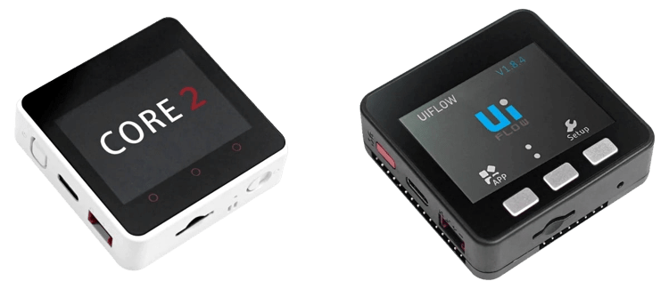
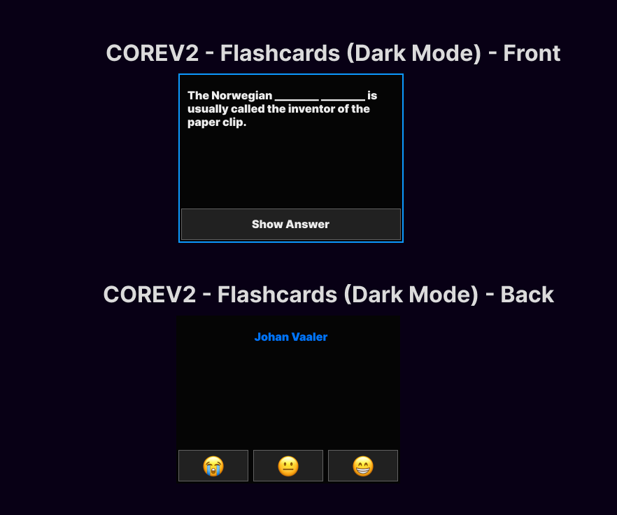

# M5 Flashcards

## Hardware Flashcards - OSS (Open Source Software)
**Examples & Inspiration:**

[Memory Hammer](https://memoryhammer.com/)

[Carden](https://getcarden.com/#card-section)

[Carden - github](https://github.com/alyssaxuu/carden)

[M5 Math Helper Example](https://www.youtube.com/watch?v=TYmWeEVSkIE)

[Zorbi Flashcards](https://zorbi.cards/)

[Anki Connect](https://foosoft.net/projects/anki-connect/)

**Gamification**
- https://habitica.com/

## Purpose
Make studying easy, less distracting and highly accessible
Instead of using a distracting cell phone you can use this pocket sized study tool to stay on task at a low cost.

## Flashcard Options:
- Front & Back (basic flash card)

- multi-line flashcards

- multiple choice cards (quiz mode?) would require input of multiple answers such as 1 right answer and 3 wrong answers A,B,C,D

- Image Occlusion Cards (Redact parts of photos to guess the corresponding parts)

- Option to Reverse the card if it's the wrong way?

- Spaced Rep → How well did you know this card using the buttons → Not At All ❌, Somewhat 😐 , Very Well ✅ , maybe an extra option in the corner for accidently flipping the card and adding it back into the queue.

- Not at All Emoji Options: ❌, 🥲

- Somewhat Recalled Emoji Options: 😐, 🤔

- Easily Recalled: ✅, 🧠, 😎

## Features
- Gamified, make learning more rewarding and fun
	- Level System 
		- Could be abused if implemented wrong
- Streaks (Much like Snapchat Streaks, a reason to come back everyday) Might want to make this not just 1 card but reviewing more than one card
	- Streaks Emoji = 🔥
- Import from Quizlet, Anki, RemNote, other
- Class Mode
	- Allow a class to monitor students progress on cards
	- import cards from teachers or other students
	- highscores between students
- Pomodoro Timer / Just Pomo Clock Mode (For studying outside of flashcards)

## Sounds
- Notification
	- Reminder to Study
- Level Up Sound (Depends on Level Up System)
- Entire Set Studied Sound (Motivation to study?)

## Accessibility
- M5Core Offers Physical buttons over touch screen on M5Core2
- Text to Speech -> Read front of and back of cards
- [Dislexic font](https://opendyslexic.org/)

## Other Considerations
- Cost -> $50 for M5Core2 (Can this get any lower, making it more accessible to people)

## EARLY UI Example

## Tags
#spacedrepitition #learning #schoolhack #flashcards 
